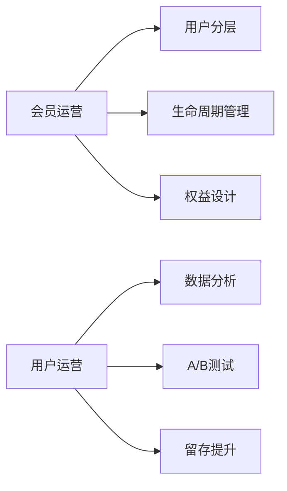

# 求职节奏分析

> [!tip] 核心策略
> 混合推进：**S级 + A级 同步投递**，不放过窗口期也不放弃练兵机会。

## 当前投递进度

查看详细岗位表：[[岗位汇总_v7_总表]]（v7 共 48 家，[Excel版](岗位汇总_2026-06-28_综合排序_v7.xlsx)）

> [!warning] 注意
> 部分岗位已发布超过2周，建议优先投递最新发布的。

### 本周优先级

- [x] S级公司微调简历
- [ ] 打招呼话术准备
- [x] 爬虫配置确认（安全方案A） %% 独立profile，极低频 %%
- [ ] 每日投递 ≥ 5家

## 关键词矩阵

| 固定关键词 | 轮换关键词 |
|:----------|:----------|
| **会员运营** ⭐⭐⭐ | ~~私域运营~~ → **CRM** |
| **用户运营** ⭐⭐⭐ | ~~用户增长~~ → **社群运营** |

每轮2固定 + 1轮换，详见 [[求职作战手册_完整版#关键词策略]]

> [!example] 轮换记录
> 第1轮：私域运营 ✅  
> 第2轮：用户增长 ✅  
> 第3轮：**CRM ← 当前**

## 技能标签优化方向

$n = 38$ 家目标公司，综合评分分布如上。

> [!faq]- 什么是S级/A级？
> - **S级（9家）**：最匹配，重点准备
> - **A级（10家）**：练手+备选  
> 详见 [[全员综合排序_2026-06-28#S级]]

---

^job-analysis-end
