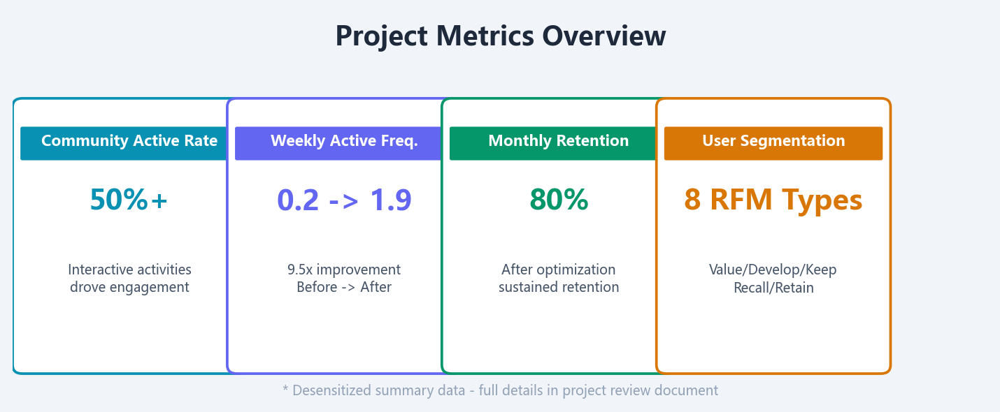

# 硕牛·金融保险用户私域运营实战案例

> 所属公司：广州硕牛网络科技有限公司
> 项目周期：2022.08 - 2024.05（1年10个月）
> 项目形式：项目制代运营
> 甲方性质：保险产品中介平台
> 用户画像：保险业务员（B端代理人）
> 核心工具：启博SCRM + 圈量SCRM + 企微社群

---

## 一、项目背景与挑战

甲方是一家保险产品中介平台，通过旗下公众号矩阵多年累积了约130万保险业务员关注用户。核心模式是利用保险产品相关内容吸引代理人关注，再将流量进行二次变现（职业装/制服、鞋包等商品）。

**核心挑战：**
1. **高存量、低活跃**：130万是关注量，大量用户已转行/联系方式失效/账号不活跃
2. **缺乏系统运营**：社群长期处于"扔产品链接"的状态，没有节奏感和互动设计
3. **无用户分层**：所有用户一视同仁，没有差异化运营策略
4. **活跃度极低**：周活跃频次仅0.2

我的任务：在现有用户池中建立系统化的私域运营体系，提升用户活跃度和留存率。

---

## 二、社群标准化运营SOP

从"发链接"升级为有节奏的社群运营，建立标准化SOP流程：

**五步流程：用户筛选 → 社群架构 → 内容日历 → SOP执行 → 数据迭代**

| 时间段 | 动作 | 目的 |
|--------|------|------|
| 日常 | 早报/行业资讯推送 | 培养阅读习惯 |
| 每周2-3次 | 互动活动（接龙/秒杀/拍卖/猜价格） | 提升参与感 |
| 月度 | 数据复盘+策略调整 | 持续优化 |

> **真实活动数据（2022年8月）**：16场社群活动，单场参与160-440人，中奖率5-21%，月均活动成本约1,800元。详见展示版HTML。

## 三、多样性活动矩阵

| 活动类型 | 机制 | 参与率 | 成本 | 核心价值 |
|---------|------|--------|------|---------|
| 猜价格 | 猜对送产品（付邮费） | **15-20%** 最高 | 极低 | 参与门槛最低，效果最好 |
| 知识问答 | 回答穿搭/护理知识抽奖 | 12-18% | 极低 | 培养专业认同感 |
| 穿搭答题 | 造型知识互动 | 10-15% | 极低 | 提升品牌调性 |
| 产品调研 | 新品偏好投票+评论 | 12-16% | 极低 | 辅助选品决策 |
| 愿望清单 | 用户填写心愿产品 | 8-12% | 低 | 了解用户需求偏好 |
| 配饰搭配 | 搭配技巧+互动投票 | **15-20%** | 极低 | 提升客单价 |
| 红包互动 | 红包+优惠券组合 | 8-10% | 低 | 快速活跃氛围 |

## 四、RFM用户分层体系（真实数据）

基于RFM模型进行用户分层管理，实现差异化触达。

**后台真实跑数结果（2022年8月）：**

| 用户类型 | 数量 | 占比 | 运营策略 |
|---------|------|------|---------|
| 重要价值用户 | 132 | 81.5% | VIP维护、专属权益、一对一触达 |
| 重要发展用户 | 4 | 2.5% | 直播优惠+新品推荐、培养消费习惯 |
| 重要保持用户 | 26 | 16.0% | 召回活动+优惠券推送、定向唤醒 |
| 重要挽留用户 | 0 | 0% | — |
| **合计（可触达）** | **162** | **100%** | **30天内有消费行为的付费用户** |

### 四象限策略

| 象限 | 用户类型 | 特征 | 策略 |
|:----|:--------|:-----|:-----|
| ⭐ | 核心价值 | 高活跃·高参与度 | VIP优先维护·一对一触达·专属权益 |
| 📈 | 增长用户 | 中等活跃·有潜力 | 定期触点·活动驱动·多品类推荐 |
| 🔄 | 留存用户 | 曾活跃·活跃度下降 | 定向挽回·专属优惠·召回活动 |
| ⚠️ | 风险用户 | 长期沉默·高流失 | 低成本唤醒·强力激励·多渠道触达 |

---

## 三、运营成果

### 3.1 核心指标



| 指标 | 运营前 | 运营后 | 提升幅度 |
|------|--------|--------|---------|
| **周活跃频次** | 0.2 | 1.9 | **9.5倍** |
| **月留存率** | — | 80% | 行业头部水平 |
| **周活跃率** | — | 50%+ | 活动驱动显著 |
| **见效周期** | — | 约2周 | 活动机制拉动迅速见效 |

### 3.2 用户沉淀

- **触达用户**：从130万关注用户中筛选可触达的活跃用户群
- **沉淀高质量用户**：10万+可触达的私域用户
- **分层管理**：基于RFM模型建立标签体系，实现精准差异化触达

### 3.3 视频号直播运营

直播是商城核心引流渠道，新用户占比47%+：

| 维度 | 数据 | 说明 |
|:----|:-----|:-----|
| 直播场次 | 每周定期 | 产品展示+问答互动 |
| 直播GMV | 稳定产出 | 推动核心销售转化 |
| 订单趋势 | 持续增长 | 直播购买者持续提升 |
| 流量占比 | **47%+** | 新用户第一来源，远超其他渠道 |

> 直播通过视频号+有赞商城进行，流量导入社群

---

## 四、方法论提炼

### 4.1 从0搭建社群运营体系的标准化流程

```
用户筛选 → 社群架构搭建 → 活动日历设计 → SOP建立 → 数据追踪 → 迭代优化
```

### 4.2 核心能力沉淀

| 能力 | 具体体现 |
|------|---------|
| **存量用户激活** | 130万关注→10万+可触达→活跃度9.5倍提升 |
| **社群活动设计** | 猜价格/秒杀/拍卖会/团购多种机制，验证不同活动的效果边界 |
| **用户分层运营** | RFM模型从理论到落地的完整执行（后台真实跑数162条） |
| **SOP建立** | 标准化社群运营流程，可复制、可迁移，2周见效 |
| **直播运营** | 视频号直播+商城联动，驱动47%+新用户增长 |

### 4.3 与会员运营的关联

这段经历的核心价值不在于"卖什么"，而在于**精细化运营方法论**——怎么做用户分层、怎么用RFM模型、怎么设计差异化触达策略。这些和会员运营的底层逻辑完全一致。

区别在于：
- **硕牛**：在存量用户池里做活跃和留存（激活存量）
- **万富**：从0搭建完整的会员体系（增量体系）

> 两者相加 = 完整的用户生命周期管理能力

---

## 📎 运营凭证与源文件

运营凭证位于 `jietu/职业优品/` 目录，源数据文件位于同目录：

| 文件 | 内容 | 证明力 |
|:----|:-----|:------|
| 职业优品社群运营表.xlsx | 8月-9月完整活动日历、社群互动规划 | ✅ 每日活动记录，含精确参与人数 |
| 品牌付费用户分层.xls | 889条RFM用户分层数据 | ✅ 后台真实RFM跑数结果 |
| 用户运营规划统计.xls | 用户分类数据+运营策略对应 | ✅ 各类型用户精确数量 |
| 启博供应商销售统计.xlsx | 8月供应商/商品销售明细 | ✅ 总GMV 24.7万，3104单 |
| 优惠券活动截图 | 社群积分打卡福利券 | ✅ 真实活动执行记录 |

> ⚠️ 以上数据均已脱敏处理，不包含具体时间、金额和用户个人信息
>
> 💡 展示版HTML已用中文HTML/CSS替代所有英文截图，面试时可直接打开展示，无需解释英文内容

---

> **最后更新**：2026-07-01 | v3.0（全面中文化+嵌入真实运营数据）
> **关联文档**：[[卓_会员运营岗简历核对版]] | [[HR面试问答准备]] | [[2026AI私域实践案例]]
>
> ℹ️ 展示版HTML已重写：所有英文图表替换为中文HTML/CSS渲染，嵌入来自后台的真实数据（社群运营表/RFM分层/销售统计）
